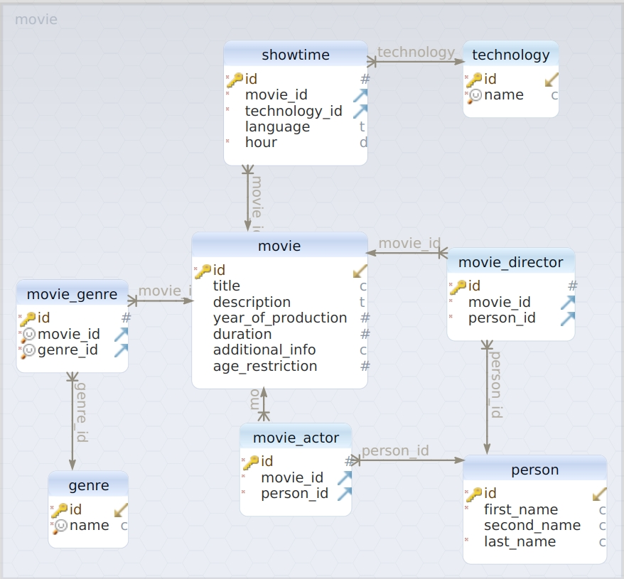

# CINEMA-BACKEND
## _Best backend for your cinema web application._
[](https://circleci.com/gh/wigryz/cinema-backend/tree/master)

### What is cinema-backend?

cinema-backend is a backend application written fully in java.
Link for [github repository][repo].

This project is developed by [jlitewka99][jlitewka99] and [wigryz][wigryz].

## Features
TODO
## Technologies
TODO
## Plugins
TODO
## Try out our application!

To start using cinema-backend you need to have java 16 installed.  
After that all you have to do is to clone our repo and run following commands:
```sh
cd cinema-backend
./mvnw spring-boot:run
```

## Docker

Provide description of how to set up this application in docker container.

## Development

Want to contribute? Great!

1. #### Cloning repository

Start by cloning your version of repository.  
To achieve it run following command:

```sh
clone git@github.com:wigryz/cinema-backend.git
```

2. #### Create your own branch

To do that you have to move to project folder and run git checkout command:
```sh
cd cinema-backend
git checkout -b <branch-name>
```
A good branch name is the one that is related to the change you want to make.  
Do not get attached to her too much - it will be deleted after merging to master.

3. #### Make some changes
While writing new classes/methods, remember to write unit / integration tests and run them using:
```sh
./mvnw verify
```
You will not be able to deliver your changes to the master until each test passes and is stable.
Also remember about running impsort:sort after making changes to make sure every import is sorted.

4. #### Create a commit
Add your changes to stage and commit them:
```sh
git add <path-to-file-you-want-to-add> # if you want to add single file
# or
git add . # if you want to add all changes from current path

git commit
```
If you are resolving an issue (for example with number 12) from github page then you should start commit title writing [#12]
and then short description of what your commit contains. After that write wider description if needed.  
Example commit message:
> [12] Resolve issue with movie status
>
> Movie did not change their status even after  
> going deprecated. Now they do.

If you have already commited but forgot about something u can still add changes to previous commit with **git commit -amend**

5. #### Push to repository
Run:
```sh
git push --set-upstream <your-branch-name>  
```
After that CI will test your change. Then you have to create Pull request, and assign another dev to provide you a review.
If review is positive, then you can merge your change with master or reviewer will do that for you.
If it is not positive, then come back to code, create new patch and commit it.  
(All commits will be squashed into one before merging to master branch).

### Continuous integration

There is a control integration named CircleCI set up for this project. It tests all branches, so after your push
there will be a run going in the background. After some time you will notice a :heavy_check_mark: - if your
build was successful or :x: - if it failed. You can click on it to get more information about tests that failed or
some information about test coverage.

What does our CI do:
* build application,
* run unit & integration tests,
* printing out code coverage,
* validate formatting and imports.

### Database



[//]: # (HERE YOU CAN ADD MORE MAGIC LINKS])
[repo]: <https://github.com/wigryz/cinema-backend>
[wigryz]: <https://github.com/wigryz>
[jlitewka99]: <https://github.com/jlitewka99>
